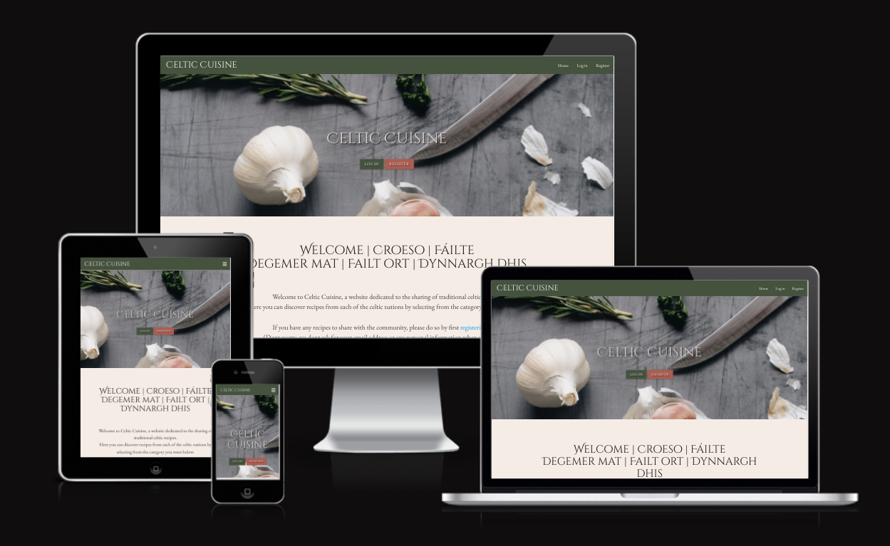

<h1 align="center">Celtic Cuisine</h1>

[View the live project here.](https://celtic-cuisine.herokuapp.com/home)

### Admin Credentials:

* Username: admin
* Password: Ctigi0305

A website dedicated to sharing traditional recipes from the celtic nations: Celtic Cuisine.

<h2 align="center"></h2>

Celtic Cuisine - developed for Project Milestone 3, for [Code Institute's](https://codeinstitute.net/) Diploma in Web App Development.

Having recently attended the [Lorient Interceltic Festival](https://www.festival-interceltique.bzh/), the creator wanted to contribute to forming stronger connections between the celtic nations. What better way is there to connect with people from different cultural backgrounds than sharing recipes for delicious and traditional foods? 


# Table of Contents
1. [Website Concept](#website-concept)
2. [Project Goals](#project-goals)
3. [User Stories](#user-stories)
    - [As a New User](#as-a-new-user)
    - [As a Returning User](#as-a-returning-user)
    - [As an Admin](#as-an-admin)
4. [Aesthetic Design](#aesthetic-design)
    - [Wireframes](#wireframes)
        - [Desktop](#desktop)
        - [Tablet](#tablet)
        - [Mobile](#mobile)
    - [Colour Palette](#colour-palette)
    - [Images](#images)
    - [Font](#font)
5. [Data Schema Design](#data-schema-design)
6. [Technical Design](#technical-design)
7. [Accessibility](#accessibility)
8. [Features](#features)
9. [Technologies Used](#technologies-used)
    - [Languages Used](#languages-used)
    - [Frameworks, Libraries, Programs and Tools Used](#frameworks-libraries-programs-and-tools-used)
10. [Testing](#testing)
11. [Future Updates](#future-updates)
12. [Initial Setup and Deployment of Celtic Cuisine](#initial-setup-and-deployment-of-celtic-cuisine)
13. [Credits](#credits)

### Website Concept:

A website for anyone who is interested in sharing and cooking traditional celtic recipes. Celtic Cuisine is a fully interactive and social website, designed to develop and strengthen the bond between people living in different celtic nations. The website aims to promote the variety of delicious traditional foods and recipes cooked in these regions.

Visitors can browse through the website and search through the current user-uploaded recipies. There is an option to sign up for free in order to contribute to the community by uploading, editing or deleting one's own recipes.

The website will clearly display information for new and returning customers including the creators contact information via social media links. The website is fully responsive on a range of devices - from hand-held devices to larger screens such as monitors and even TVs. This is to ensure that as many people as possible can visit the website.


### Project Goals:

The main brief for this project is to showcase the CRUD features of both a relational and a non-relational database management ssytem. The goal is to combine a conventional relational database (postgreSQL) and a non-relational database (MongoDB) and to allow them to work seemlessly together, with the ability to link both databases with no impact on the user experience. By combining both, the project can serve multiple approches to database management and CRUD functionality.

The website is a full stack project that aims to showcase the creators backend and frontend development skills, learned during the MS3 portion of the web app development course. Code Institute's brief was to develop a project that utilized both a conventional relational database and a non-relational database, and aim for them to synchronize and link data.

## User Stories

Following are the goals that the website should provide for each user.

#### As a New User :
* 001 - I want to to be able to access and view the website on the device I'm using.
* 002 - I want to to be able to understand the website immediately.
* 003 - I want to to be able to navigate the website with ease.
* 004 - I want to to be able to contact the website developers if I wish to.
* 006 - I want a reason to return.

#### As a Returning User :
* 001 - I want to find information about the company's background, their story and growth.
* 002 - I want to find the best way to get in contact with the company with any questions I may have.
* 003 - I want to be able to easily log in to my account.
* 004 - I want to be able to view my own recipes.
* 005 - I want to be able to add my own recipes.
* 006 - I want to be able to edit my own recipes.
* 007 - I want to be able to delete my own recipes.
* 008 - I want to to be able to access and view the website on a range of devices/browsers.

#### As an Admin :
* 001 - I want to have more control than any other user.
* 002 - I want to be able to view more data than other users.
* 003 - I want to be able to add data to the website.
* 004 - I want to be able to edit data from the website.
* 005 - I want to be able to delete data from the website.


## Aesthetic Design
Once the user goals and the projects intentions were set out, the next step was to design the aesthetic aspects of the Celtic Cusine site.

### Wireframes
Wireframes were drawn using [Balsamiq](https://balsamiq.com/) at the beginning of the project. They were referenced throughout the design and building of the website. The full set of wireframes may be found [here](https://github.com/danielj314/celtic-cuisine-pm3/tree/main/celticcuisine/documentation/wireframes). 

Below is a set of images showing Celtic Cuisine on the three main screen sizes: desktop, tablet and mobile. Every major section of the website is also included.

#### Desktop


- Home Page Wireframe


- Recipes Wireframe


- Full Recipe Wireframe


- Add Recipe Wireframe


- Edit Recipe Wireframe


- Log in  Wireframe


- Register Wireframe


#### Tablet

- Home Page Wireframe


- Recipes Wireframe


- Full Recipe Wireframe


- Add Recipe Wireframe


- Edit Recipe Wireframe


- Log in  Wireframe


- Register Wireframe


#### Mobile

- Home Page Wireframe


- Recipes Wireframe


- Full Recipe Wireframe


- Add Recipe Wireframe


- Edit Recipe Wireframe


- Log in  Wireframe


- Register Wireframe


-


### Colour Palette
- The colour palette was chosen to reflect the traditional green and brown colours associated with celtic culture. The specific shades have been chosen to give the site a more modern and high quality "earthy" feel. 

- This was the colour template selected for the design of the site:


- All buttons have a consistent style, size and layout throughout the website (see more in the buttons [Features](#features) section), except for the buttons on the home page which are visible only to the Admin user. This was decided in order to highlight them for the admin user's convenience. 

- The text colour is white (rgb(255,255,255)) for the website's navbar and footer. This ensures a constant and obvious contrast between text and any background content or colours. When the background is much lighter, the text colour is reversed to black (rgb(0,0,0)), again to ensure clarity. 

- \white text is also used for the static text used on the nations and recipe cards on the site. The category labels being white differentiates the labels from the black text used to present the unique data that has been uploaded to each recipe.

- Some shadows (slightly opaque black) are added to interactive elements and cards to help with depth and contrast. When the shadow appears on cursor hover, they serve as hints to the user that that element can be clicked.


### Images
- The use of photography is vital in creating allure and desire, especially for a food recipe website. Users are drawn by what they see. The hero image on the home screen is large and complements the color pallet used for the rest of the website.

- It's vital for the theme to be clear and obvious. The hero image makes the website recognizable and memorable so people recall and return to it, as well as attractiong the attention of first time visitors. This, along with the CSS styling and colour palette solidifies the theme.

- Users are invited to add their own image to the recipes that they create and as such there will be a wide variety of different colours and quality images viewed on the site. The colour pallet chosen for the site is modest and should allow the images of the foods to stand out on the site.

### Font
-  Celtic Cuisine uses the Cinzel Decorative font for the titles of the page. Cursive is used as a secondary option, being the most similar to the primary choice.

-  The body of the site uses EB Garamond. It was selected for its clean and clear style which compliments the title font without compromising on readability - a vital design feature for any website. 

-  Both fonts are available for free via [Google Fonts](https://fonts.google.com/) and imported via CSS. Serif is used as a secondary option for the body in case of failure to import the font into the website correctly. 

## Data Schema Design
Here is the Database Schema layout for the Celtic Cuisine website:


- The schema shows each collection, what data is stored within them, the data type and how they are linked together.

- This schema is vital in developing the website's functionalit and features.

- The models.py file holds the database model for the Nations and Users tables which were created and stored in PostgreSQL.

- MongoDB holds the recipes collection. 

- Information on how these databases were created can be found below.

## Technical Design
Once the user goals and the projects intentions were set out, the next step was to design the technical structure of the Celtic Cuisine site.

- The main CRUD functions and data manipulation are written in the routes.py file.
- The PostgreSQL model template/design is found in the models.py file.
- The linking to Flask is stored in the run.py file.
- The celticcuisine folder runs as the flask app with all site related content found inside
- The templates folder contains all of the html webpages found on Celtic Cuisine.
- The Procfile was created to link to Heroku which hosts the app.


### Jinja Template

- Jinja2 was used as the templating engine. The structure is found throughout the html pages.

- base.html is the main structure and navigation template for the site. A base template creates a platform for all other pages within the website to extend from. The other html pages reference the base.html using the Junja2 templates below:

```

```
```


```

### Defensive Programming
Defensive programming is used throughout the Celtic Cuisine app. By linking the session cookie to the username, certain functions of the site are controlled:
```
if "user" not in session or session["user"] != "admin":
```
When not met, the current user/visitor is presented with a Flash message to inform them that they are unable to undertake such tasks as deleting other user's recipes or editing/deleting the nations categories.

It was decided that although the Admin account may delete other user's recipes, they cannot edit them as the recipes are unique to their creators and should not be able to be changed by anyone else.


## Modal
Modals form an integral part of the websites design. They act as a to confirm that the user's actions were intended and creates a much more user-friendly experience. Confirming the actions through the modal allows the user to think again, confirm or avoid making a mistake (such as accidentally clicking a button and instantly deleting a recipe).


## Accessibility
Always an important aspect of design for every website. Celtic Cuisine includes:
-   Semantic design.
-   The use of alt to describe images and other content.
-   Aria-labelledby to link sections.
-   Colour and contrast considerations and testing.
-   Labels on forms.
-   Prompts to help guide users.

## Features
There are universal features that are present throughout the Celtic Cuisine website. These feature are:
- Responsive on all device sizes - from 320px upwards to larger desktops reaching 1200px and more.
- Fully-responsive nav bar (including mobile nav bar)
- Mobile-friendly, adjusting automatically at specific breakpoints thanks to Materialize's easy-to-use css framework and custom overriding style classes.
- Celtic Cuisine logo/name is seen at all times in te top left corner of the screen or at the top of the mobile menu on smaller devices. This is vital for brand consistency and serves as a simple way of reminding the user of the website's name. The logo is clickable and always takes the user back to the Celtic Cuisine home page (home.html).
- Clear and obvious navbar links to other pages within the website.
- Fully responsive footer which matches the design and colour palette of the top navbar.
- Social links in footer, linking to the creators social links and provides ways to contact them.
- Name of website designer with link to their profile along with copyright info in footer.
- All clickable images, buttons, links, etc. have a hovering cursor to signify that that element can be interacted with. The majority of these elements being visually promted either throgh a short zoom in/out animation, colour change or highlighting.
- A Flash text appears at the top of the webpage whenever a user or admin completes a task - by either adding, editing or deleting information. This informs the user that their task was recognised and completed successfully.

Below is a breakdown of the design features on each of the main webpages within the Celtic Cuisine website:

### - Home page (home.html)

All visitors will be welcomed by the home page. The features include:
- The user is met with a large hero-image (hero.jpg) with Celtic Cuisine centered within.
- There are two buttons below this to entice the user to 'Log In' or 'Register'. These buttons change to a single  'Add recipe' button if the user is already logged in.
- Below the hero image, there is a welcome message in each of the 6 recognised celtic languages followed by some short sentences advising the user on the purpose of the site and how they user can use it.
- Next is the Nations categories section where card templates from Materialize have been added to highlight each of the nations categories storing their respective recipes. The cards include an image of the flag of each nation, making it very clear to the user what options they have to select from.

### - Recipes page (recipes.html)

This is where every recipe for each Nation category is listed. All visitors to the website can view this webpage. The features include:
- Clear page title at the top in the center of the page to reassure users that they are on the recipes page. The title changes depending on the name of the nation that the user has decided to view.
- A list of every recipe linked with the relevant nation in card format, with purposefully limited but relavant information related to that recipe.
- Ability to click on 'Full Recipe' button at the bottom of each recipe card linking the user to the full recipe page (full_recipe.html).


### - My Recipes page (my_recipes.html)

This is where every recipe the user has submitted is listed. Only registered users including admin can view this page. The features include:
- The username of the logged in user is presented in large text at the top of the page.
- The 'Add Recipe' button under the username, when clicked advances to the 'Add Recipe' page.
- A list of the specific users submitted recipes presented in card format, with purposefully limited but relavant information related to each recipe.
- A clickable link at the bottom of each seperate recipe card to advance to the full recipe page (rull_recipe.html).

### - Full Recipe page (full_recipe.html)

The Full Recipe page is where the visitor can see the full recipe for the recipe they selected. All visitors to the website can view this webpage. The features include:
- Recipe name in large page title, above the recipe.
- If the recipe was submitted by the user, the 'Edit' button is visible above the full recipe card. This forwards the user to the Edit Recipe (edit_recipe.html) page.
- If the recipe was submitted by the user, or is being viewed by admin, the 'Delete' button is visible above the full recipe card, which allows the user to delete the recipe. The user is met with a modal that asks for confirmation on wheither they want to delete the recipe. User must click 'Delete' again to confirm this (which will then delete the recipe from the website and the database), otherwise they can cancel by clicking the 'Cancel' button or by just clicking off screen or pressing ESC on the keyboard and the recipe will remain in place. 
- The 'Edit' and 'Delete' buttons are hidden if the user did not create the recipe.
- The 'Edit' button is hidden from the admin account also, as it was decided that although the Admin account may delete other user's recipes, they should not edit them as the recipes are unique to their creators and should not be able to be changed by anyone else.
- All of the information that was provided by the recipe's creator when the recipe was submitted is shown on the recipe card.
- A large image of the recipe if provided by the creator. If no image was submitted by creator, a placeholder image of an empty plate appears instead.


### Add Recipe (add_recipe.html)

The Add Recipe page allows users to add their recipe to the website via a form. Only registered users (including admin) can use this feature. The recipe is added to the relevant nations category which can be found in the recipes page (recipes.html) and the My Recipes (my_recipes.html) page. The features include:
- Placeholders and labels on all inputs serve as helpful guidence for users.
- Several inputs linked to the database (see data schema, code breakdown etc for explanation of inputs, types, data links etc.)
- Recipe Name - The name that will be presented for all to see on the recipe card.
- Dropdown select options for user to choose the Nations Category their recipe belongs to. Admin has control over which categories are added to the website/database.
- Recipe Image - allows user to add a URL for their recipe image.
-Recipe Description - A text input where users insert a short description of their recipe.
- Method - The steps for cooking the recipe are added here. Each step must be added on a different line in order for them to render correctly on the full recipe page.
- Ingredients. Just like the the Method input, each ingredient must be added on a different line in order for them to render correctly on the full recipe page..
- Preperation Time - How long it takes to prepare the recipe. The placeholder text advises the user on the correct format to use.
- Servings. The placeholder text advises the user on the correct format to use.
- 'Add Recipe' button - This button submits the form to the MongoDB database if all inputs are valid and met.

### Edit Recipe (edit_recipe.html)

The Edit Recipe page is for users to edit their own recipe via a form. Only registered users (incliding admin) can use this feature. The edited recipe is updated when the form is submitted and is found in the same places as the original recipe. The information expected from the user is the same as the add_recipe.html page. The features include:
- Labels on all inputs with the currently stored data/value is shown in each input field.
- 'Edit Recipe' button - when clicked, submits the updated form to the MongoDB database if all inputs are valid and met and updates that specific recipe.

### - Add Nation page (add_nation.html)

The Add Nation page is where the admin can add new nation categories to the website. There are 6 main celtic nations - these are currently included in the database - however there are other smaller regions such as Asturias that could be added in the future if there is demand for it from the site's visitors/users. Any added nations will then be avaiable to choose from the homepage and the create/edit recipe forms via dropdown (see add_recipe.html and edit_recipe.html). Again, only the admin can view this page. The features include:
- Page title in large at top of the page.
- Category Name placeholder and label on input field.
- 'Add Nation' button. When clicked, submits the form and returns to Home page, where the newly created nation card will be visible.

### - Edit Nation page (edit_nation.html)

The Edit Nation page is where the admin can edit a current nation category. The category will then be updated in the database and shown on the homepage. Again, only the admin can view this page. The features include:
- Page title in large at top of the page.
- Category Name label and current value in input.
- 'Edit Nation' button. When clicked, submits the form and returns to the home page, where the edit category is updated on the list.

### - Log In page (login.html)

The Log In page is where visitors can enter their details and log in to their account. All visitors to the website can view this webpage. The features include:
- 'Log In' title on top of the page.
- Username input with placeholder and validation applied.
- Password input with placeholder and validation applied.
- 'Log In' button. When clicked, the user is forwarded to their personal My Recipes (my_recipes.html) page.

### - Register page (register.html)

The Register page is where visitors can enter their details for the first time to register their new account. All visitors to the website can view this page. The features include:
- 'Register' title on top of the page.
- Username input with placeholder and validation applied.
- Password input with placeholder and validation applied.
- Confirm Password input with placeholder and validation applied.
- 'Register' button. When clicked, the user is forwarded to their personal My Recipes (my_recipes.html) page.


## Interactive Elements & Features
Following is a list of all interactive elements found on the Celtic Cuisine website.

#### Celtic Cuisine website logo
The website logo and title is very clear and obvious. This is always located in the top left corner of the page on all device sizes and on all pages. It serves as a constant reminder to the user about the brand and the website they are visiting. The logo itself is a clickable link (a finger cursor pointer appears when hovering over), and returns the user back to the home page at any time. 

```
<a href="{{ url_for('home') }}" class="brand-logo header-title">Celtic Cuisine</a>
```

#### Buttons
The buttons serve as triggers for users to perform various actions. An action is called on those buttons and are linked on the back-end.

The buttons found in front of the home.html hero image change from 'Log In' and 'Register' to 'Add Recipe' when user is logged in. This is done by user sesssion capabilites and Jinja templating:

```

<a href="{{ url_for('add_recipe') }}" class="btn-large background-cabbage">
    Add recipe<i class="fas fa-plus-square right"></i>
</a>

<a href="{{ url_for('login') }}" class="btn background-cabbage">Log in</a>
<a href="{{ url_for('register') }}" class="btn background-matrix">Register</a>

```

#### - Delete Buttons
- Due to the nature of this button and it's significance, it was decided to style this differently with a matrix-red colour. Red is traditionally used to indicate danger or a warning, and so it ensures the users double-check before clicking any of these buttons.

#### - Admin Only Buttons

Some buttons are only available to admin. These are found on the homepage and are all related to editing the nations categories. They are coloured differently to all other buttons on the site in order to highlight them for the admin account. The actions that these buttons perform when pressed can signifficantly alter the site -such as deleting a nations category and all its associated recipes. This is why the brighter colours were chosen for these buttons, as seen in the image below.


#### Flash messages

Flask provides a simple Flash method that relays a message which appears at the top of the webpage to inform the user of their actions. Some examples are when the user registers successfully, logs in, creates a new recipe, deletes a recipe.

The code for this is stored in the base.html template so that the feature is available to use from all subsequent pages. The messages themselves are written as part of the functions in the routes.py file.

```

    
        
            <div class="row flashes">
                <h4 class="center-align">{{ message }}</h4>
            </div>
        
    

```

## Technologies Used

### Languages Used

-   [HTML5](https://en.wikipedia.org/wiki/HTML5)
-   [CSS3](https://en.wikipedia.org/wiki/Cascading_Style_Sheets)
-   [JavaScript](https://en.wikipedia.org/wiki/JavaScript)
-   [Python](https://en.wikipedia.org/wiki/Python_(programming_language)
-   [Jinja2](https://en.wikipedia.org/wiki/Jinja_(template_engine)

### Frameworks, Libraries, Programs and Tools Used

1. [Google Fonts:](https://fonts.google.com/)
    - Google fonts is used to import the 'Poppins' font into the style.css file which is used on all fonts within the website.
2. [Font Awesome:](https://fontawesome.com/)
    - Font Awesome is used on all pages throughout the website to add icons for aesthetic and UX purposes.
3. [jQuery:](https://jquery.com/)
    - jQuery is used to simplify and manipulate some tasks instead of regular JS.
4. [Git:](https://git-scm.com/)
    - Git is used for version control by utilizing the Gitpod terminal to commit to Git and Push to GitHub.
5. [GitHub:](https://github.com/)
    - GitHub is used to store the projects code after being pushed from Git.
6. [Gitpod:](https://gitpod.io/)
    - Development environment to build the website.
7. [Balsamiq:](https://balsamiq.com/)
    - Balsamiq is used to create the [wireframes](#wireframes) during the design process.
8. [Eye Dropper:](https://eyedropper.org/).
    - This colour picker tool was used to to pick and experiment with colours.
9. [Coolors:](https://coolors.co/)
    - This tool was used to to setup the colour palette.
10. [TinyPNG:](https://tinypng.com/)
    - TinyPNG is used to optimize images used in the website and documentation.
11. [Am I Responsive?:](http://ami.responsivedesign.is/)
    - Used to create the image at the very top of this document.
11. [Pexels:](https://www.pexels.com/)
    - Used to find stock images for site.
12. [dbdiagram:](https://dbdiagram.io/)
    - Used to create the database scheme.


- PostgreSQL
- MongoDB 
- PsycoPG2 - database adapter. library for connecting Python to PostgreSQL.
- SQLAlchemy - ORM library
- PyMongo
- Flask
- Flash
- dnspython
- flask-paginate
- materializecss
- heroku
- Werkzeug


## Testing

Due to the extensive testing necessary for Celtic Cuisine, the full documentation can be found [here](TESTING.md).

## Future Updates

There are many planned updates arranged for the Celtic Cuisine that include but are not limited to:

-   Introduction of more social features such as:
    - Ability to like/rate other recipes
    - Ability to favourite recipes and add to the user's profile
    - Commenting on recipes
    - Instant social media links to share, comment, link etc
-   Link email for subscription, mail etc
-   Users able to:
    - Delete profile
    - Edit profile further
-   More admin rights such as:
    - Delete user profiles
    - Edit user profiles
-   Theme colour changes.

# Initial Setup and Deployment of Celtic Cuisine:

1. The Code Institute's template was used for basic setup, found [here](https://github.com/Code-Institute-Org/gitpod-full-template).
2. In the Gitpod CLI, install two python packages. Flask and SQLAlchemy to work with Postgres databases. psycopg2 is necessary to work with Postgres database. In command line type: `pip3 install Flask-SQLAlchemy psycopg2`
3. Create "env.py" file
4. Create a ".gitignore" file if you choose not to use Code Institute's template. Add `env.py` and the soon to be generated `__pyache__/` to it. All hidden and sensitive files/folders to be added here.
5. In "env.py", type following:
    ```
    import os

    os.environ.setdefault("IP", "0.0.0.0")
    os.environ.setdefault("PORT", "5000")
    os.environ.setdefault("SECRET_KEY", "any_secret_key")
    os.environ.setdefault("DEBUG", "True")
    os.environ.setdefault("DEVELOPMENT", "True")
    os.environ.setdefault("DB_URL", "postgresql:///<DATABASE>")
    ```

    The `any_secret_key` can be called whatever you wish or you can generate a random and secure password here: https://randomkeygen.com/

    Make sure to change `os.environ.setdefault("DEBUG", "True")` to "False" before deploying/launching project (only applicable in Heroku deployment if launching a live project. Unecessary if purely used for testing and development - this is actually to be done in the Heroku Config Vars on their platform, more later).

6. Create a folder (in this case, folder is named "celticcuisine") in the root of your project.
7. Within that newly created folder, create a file called `__init__.py`
8. Write the following in the new file:
    ```
    import os
    from flask import Flask
    from flask_sqlalchemy import SQLAlchemy
    if os.path.exists("env.py"):
        import env  # noqa


    app = Flask(__name__)
    app.config["SECRET_KEY"] = os.environ.get("SECRET_KEY")
    app.config["SQLALCHEMY_DATABASE_URI"] = os.environ.get("DB_URL")

    db = SQLAlchemy(app)

    from celticcuisine import routes  # noqa
    ```
9. Create a "routes.py" file within the "celticcuisine" folder
10. Within that "routes.py" file, write the following:
    ```
    from flask import render_template
    from celticcuisine import app, db


    @app.route("/")
    def home():
        return render_template("base.html")
    ```
11. In root of project, create "run.py" file
12. Within "run.py", write the following:
    ```
    import os
    from celticcuisine import app


    if __name__ == "__main__":
        app.run(
            host=os.environ.get("IP"),
            port=int(os.environ.get("PORT")),
            debug=os.environ.get("DEBUG")
        )
    ```
13. Within "celticcuisine" folder, create a new "templates" folder. This is where Flask will search for any html templates to be rendered.
14. Create a new file "base.html" within the "templates" folder.
15. Within the "base.html" file, write "Hello World!".
16. In the terminal, write `python3 run.py` to launch the project.
17. Add, commit and push these changes to github.

# Setting up Databse - postgreSQL database:

Make sure you have postgreSQL installed locally if you are not using CI's template.
Set up the databse schema as follows:
1. Define the models by creating a "models.py" file within the "celticcuisine" folders
2. write the following in the "models.py" file and create the tables:

    ```
    from celticcuisine import db


    class Nations(db.Model):
        # schema for the Nations model
        id = db.Column(db.Integer, primary_key=True)
        category_name = db.Column(db.String(25), unique=True, nullable=False)

        def __repr__(self):
            # __repr__ to represent itself in the form of a string
            return self.category_name


    class Users(db.Model):
        # schema for the Users model
        id = db.Column(db.Integer, primary_key=True)
        user_name = db.Column(db.String(50), unique=True, nullable=False)
        password = db.Column(db.String(260), nullable=False)

        def __repr__(self):
            # __repr__ to represent itself in the form of a string
            return self.user_name
    ```
3. In "routes.py", import these newly created models:
    ```
    from celticcuisine.models import Category, Users
    ```
4. Log in to postgreSQL terminal by typing psql in terminal.
5. Type `CREATE DATABASE celticcuisine;`
6. Then `\c celticcuisine;` to connect to the newly created database.
7. Finally `\q` to exit.
8. Use python to generate and migrate the models into the database. if any changes are made to this database, you must repeat the same steps to refresh and update your database. in the terminal, type `python3`.
9. Type `from celticcuisine import db`
10. Type `db.create_all()`
11. If you wish to check that the tables exist, type `psql -d celticcuisine` followed by `\dt` then `\q` to quit, otherwise just exit via `exit()`.
12. Commit then push

# Setting up Database - MongoDB database:

Make sure to that you have a MongoDB account.

1. Create a cluster (https://www.mongodb.com/basics/clusters/mongodb-cluster-setup). This project uses a shared cluster. Choose the closest region to you which is free to use. Free cluster tier and then name your `<CLUSTER>` ("myFirstCluster", in this project).
2. In Database Access, add a new database user (https://www.mongodb.com/docs/atlas/security-add-mongodb-users/#add-database-users).
3. In Network Access, click add IP address and choose 'Allow Access From Anywhere'. Input the IP of your hosts here to add further security.
4. In the newly created `<CLUSTER>`, click on Create a Database and under Database Name, enter a `<DATABASE>` name, ("celtic_cuisine", in this project)
5. Under collection name, enter `<COLLECTION>` ("recipes", in this project).
6. Within the `<DATABASE>` ("celtic_cuisine"), click on Create Collection button and enter any other collections you wish to store.
7. Within each collection, click on Insert Document, and enter the key-value pairs you wish to store in your document. For this project, the following key names and value data types were stored:
    ```
    _id: <ObjectId>
    category_id: <string>
    recipe_name: <string>
    recipe_image: <string>
    recipe_description: <string>
    ingredients: <string>
    method: <string>
    prep_time: <string>
    servings: <string>
    created_by: <string>

    ```
8. In the terminal, install dnspython `pip3 install dnspython`
9. Install pymongo too `pip3 install flask-pymongo`
10. On the MongoDB website, in your collection, connect your cluster. Choose 'Connect your application' and choose Python and your version (3.6 or later, in this project).
11. Copy the connection string.
12. In the "env.py" file, add the following environment variables to the already present ones:
    ```
    os.environ.setdefault("MONGO_URI", "mongodb+srv://<USERNAME>:<PASSWORD>@<CLUSTER>.1megs.mongodb.net/<DATABASE>?retryWrites=true&w=majority")
    os.environ.setdefault("MONGO_DBNAME", "<DATABASE>")
    ```
    Make sure to insert your own information for `<USERNAME>`, `<PASSWORD>`, `<CLUSTER>` and `<DATABASE>`.
13. In "__init__.py" add  `from flask_pymongo import PyMongo`.
14. Add and update:
    ```
    app.config["MONGO_DBNAME"] = os.environ.get("MONGO_DBNAME")
    app.config["MONGO_URI"] = os.environ.get("MONGO_URI")

    mongo = PyMongo(app)
    ```
15. In "routes.py", update entire file to be:
    ```
    from flask import (
        flash, render_template,
        request, redirect, session, url_for)
    from bson.objectid import ObjectId
    from celticcuisine import app, db, mongo
    from celticcuisine.models import Category, Users


    @app.route("/")
    def home():
        return render_template("home.html")
    ```
16. In terminal, write `touch celticcuisine/templates/home.html`
17. In "home.html" add your website content here (use templates and link "base.html" to all other pages etc)
18. In terminal, "python3 run.py" to view your work.
19. Add, commit, push to github.

# Deploy the Application to Heroku:

1. Create a "requirements.txt" by typing `pip3 freeze --local > requirements.txt` in the terminal. This lists what is necessary to run the project.
2. Create a Procfile by typing `echo web: python run.py > Procfile` in the terminal. In the newly created "Procfile", check to see if a blank line appears under the written code. If there is, delete and save that change. It can cause issues with Heroku.
3. Commit and push.
4. On the Heroku website. Create a new app and name it. Choose the region closest to you.
5. Create a new database on Heroku. Resources > Add-ons, search for heroku postgres and choose the 'Hobby Dev - Free' option, or whichever suits your needs.
6. Once confirmed, go to Settings > Config Vars > Reveal Config Vars, and input the following:
    ```
    IP = 0.0.0.0
    PORT = 5000
    SECRET_KEY = your_secret_key_here
    MONGO_URI = mongodb+srv://<USERNAME>:<PASSWORD>@<CLUSTER>.1megs.mongodb.net/<DATABASE>?retryWrites=true&w=majority
    MONGO_DBNAME = your_database_name_here
    ```
    You can add:
    ```
    DEBUG = True
    ```
    temporarily but MAKE SURE to change to `False` when finalizing the app. Keep to `True` for error fixing during development.
7. In your Config Vars in Heroku, if DATABASE_URL starts with `postgres` instead of `postgresql`, update your `__init__.py` file to:
```
import os
import re
from flask import Flask
from flask_pymongo import PyMongo
from flask_sqlalchemy import SQLAlchemy
if os.path.exists("env.py"):
    import env  # noqa


app = Flask(__name__)
app.config["SECRET_KEY"] = os.environ.get("SECRET_KEY")
app.config["MONGO_DBNAME"] = os.environ.get("MONGO_DBNAME")
app.config["MONGO_URI"] = os.environ.get("MONGO_URI")

uri = os.environ.get("DATABASE_URL")
if uri.startswith("postgres://"):
    uri = uri.replace("postgres://", "postgresql://", 1)
app.config["SQLALCHEMY_DATABASE_URI"] = uri  # heroku

db = SQLAlchemy(app)
mongo = PyMongo(app)

from celticcuisine import routes  # noqa
```
This wil ensure that the database is correctly linked.
8. In github, make sure you've added, commited and pushed your latest work.
9. The following point is an extract taken from Code Institute:

    ```
    Automated Deployments from GitHub disabled by Heroku
    Due to a security issue, Heroku has disabled automated deployments from GitHub. Unfortunately, we have no indication if or when they will reactivate this. In order for you to deploy while this situation persists, please follow the steps below to deploy from your Gitpod workspace:

    - Open the terminal.
    - For those of you who are using MFA/2FA: please scroll down to see the additional steps required.
    For those of you not using MFA/2FA: Log in to Heroku and enter your details.
    command: heroku login -i
    - Get your app name from heroku.
    command: heroku apps
    - Set the heroku remote. (Replace <app_name> with your actual app name and remove the <> characters)
    command: heroku git:remote -a <app_name>
    - Add and commit any changes to your code if applicable
    command: git add . && git commit -m "Deploy to Heroku via CLI"
    - Push to both GitHub and Heroku
    command: git push origin main
    command: git push heroku main

    MFA/2FA enabled?
    - Click on Account Settings (under the avatar menu) on the Heroku Dashboard.
    - Scroll down to the API Key section and click Reveal. Copy the key.
    - Back in your Gitpod workspace, enter the command: heroku_config , and enter your API key you copied when prompted.
    - Continue from step 3 above. If you get prompted to log in at any point:
      - Enter your Heroku username.
      - Enter the API key you just copied.
    
    Need to deploy again?
    You should just be able to add, commit and push, and if prompted enter your username and API key again.

10. Click 'Open App' in heroku, and your project will be displayed here.
11. Due to the automatic deployment issues on heroku's part, any changes to your app will need to manually be updated by following step 8. again.
12. We need to create our tables on the Heroku database. In Heroku, on the top-right, clcik More > Run Console.
13. Type `python3`
14. Type `from celticcuisine import db` then `db.create_all()` then `exit()`
15. In GitHub, change your `env.py` to reflet the newly created database by deleting `os.environ.setdefault("DB_URL", "postgresql:///celticcuisine")` and inserting `os.environ.setdefault("DATABASE_URL", "<heroku string>")` from Heroku's config vars.

### Forking the GitHub Repository

The following instructions are taken from Code Institutes [README.md template](https://github.com/Code-Institute-Solutions/SampleREADME/blob/master/README.md)

By forking the GitHub Repository we make a copy of the original repository on our GitHub account to view and/or make changes without affecting the original repository by using the following steps...

1. Log in to GitHub and locate the [GitHub Repository](https://github.com/)
2. At the top of the Repository (not top of page) just above the "Settings" Button on the menu, locate the "Fork" Button.
3. You should now have a copy of the original repository in your GitHub account.

### Making a Local Clone

1. Log in to GitHub and locate the [GitHub Repository](https://github.com/)
2. Under the repository name, click "Clone or download".
3. To clone the repository using HTTPS, under "Clone with HTTPS", copy the link.
4. Open Git Bash
5. Change the current working directory to the location where you want the cloned directory to be made.
6. Type `git clone`, and then paste the URL you copied in Step 3.

```
$ git clone https://github.com/YOUR-USERNAME/YOUR-REPOSITORY
```

7. Press Enter. Your local clone will be created.

```
$ git clone https://github.com/YOUR-USERNAME/YOUR-REPOSITORY
> Cloning into `CI-Clone`...
> remote: Counting objects: 10, done.
> remote: Compressing objects: 100% (8/8), done.
> remove: Total 10 (delta 1), reused 10 (delta 1)
> Unpacking objects: 100% (10/10), done.
```

Click [Here](https://help.github.com/en/github/creating-cloning-and-archiving-repositories/cloning-a-repository#cloning-a-repository-to-github-desktop) to retrieve pictures for some of the buttons and more detailed explanations of the above process.

## Credits

### Code
- This README.md document was based on Code Institutes [SampleREADME](https://github.com/Code-Institute-Solutions/SampleREADME/blob/master/README.md). The template was used as a guide, then filled with content related to this website. The MS2 Quiz [README.md](https://github.com/rhysmoggs/ms2-quiz/blob/main/README.md) file - the developers personal MS2 submission for the Code Institute course - was also used and then edited to suit this project.


### Inspiration

-   The Lorient Interceltic Festival. Website found [here](https://www.brittanytourism.com/matching-what-i-want/culture-and-heritage/brittanys-main-events/festival-interceltique-de-lorient/). The inspiration for a celtic themed website.

### Content & Media

-   The hero image (hero.jpg) - Photo by Kelly L from Pexels found [here](https://www.pexels.com/).


### Acknowledgements

-   Stack Overflow [website](https://stackoverflow.com/) for general problem solving.

-   Tutor support at Code Institute.