# Celtic Cuisine - Testing details

[Back to README.md file](README.md)

[Live website](https://celtic-cuisine.herokuapp.com/home)

___
## Contents
* [Code Validation](#code-validation)
* [Automated Testing](#automated-testing)
    + [Lighthouse Testing](#lighthouse-testing)
* [Manual Testing](#manual-testing)
    + [Functionality Testing](#functionality-testing)
    + [Responsiveness](#responsiveness)
    + [Cross Browser](#cross-browser)
* [User Stories Testing](#user-stories-testing)
* [Bugs and Fixes](#bugs-and-fixes)
___

## Code Validation

1. **HTML validated on [W3C Markup Validation Service](https://validator.w3.org/)**
Checked using the 'Validate By URI' as with the jinja templating the direct input method was unsuitable. 
* All pages were checked and the same warning came up for each page as the code it referenced is contained in the base html page. 

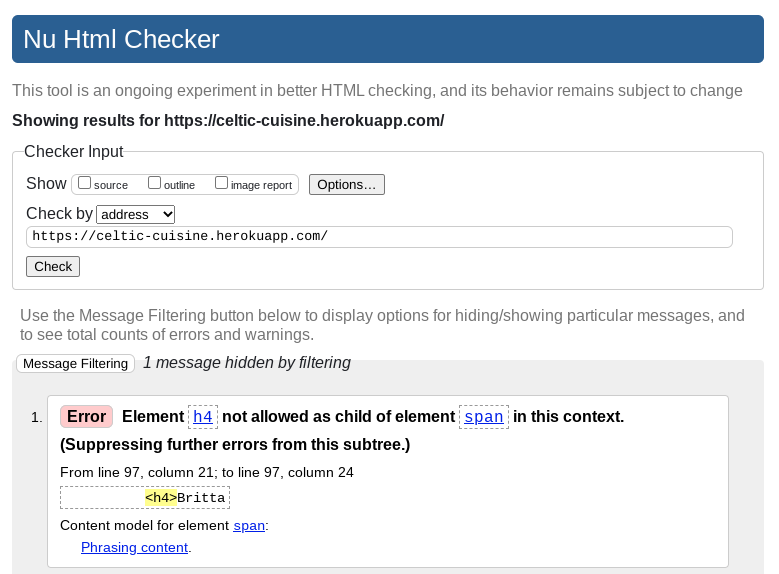

* The warning refers to the flashed messages section. This does contain a `h4` heading within a div. I added in another h4 heading which then brought up a warning about an empty heading so I decided to revert to the original code.

* Similar errors were found on the add_recipe and edit_recipe pages. I believe this is because the html checker was reverting to the homepage as aaccess is blocked to these pages when a user is not logged in, thus unable to be checked by the w3c service.

* Further error was detected on the 'recipes' page:

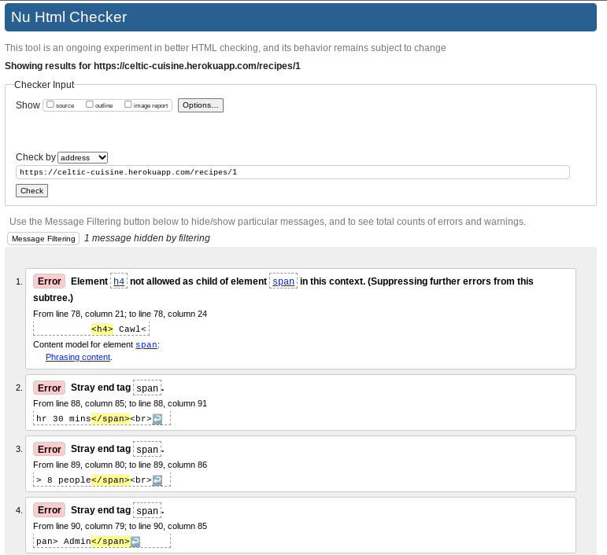

* These were typing errors where a closing tag was added automatically after an opening tag and was not noticed. I amended this, ran the page through the checker again and the error was resolved. 

2. **CSS validated on [W3C CSS Validation Service](https://jigsaw.w3.org/css-validator/#validate_by_input)**
Checked using the 'Validate by Direct Input' method.
* One error and 3 warnings were found. 

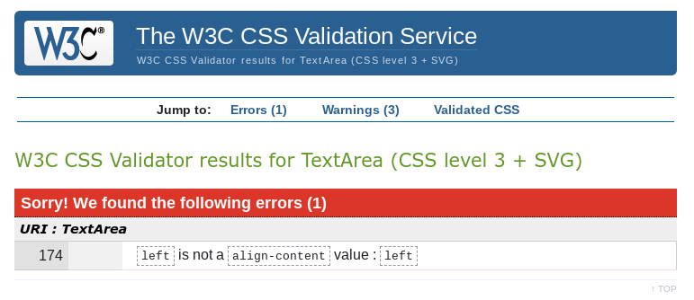

* The error was corrected and checked second time with zero errors:

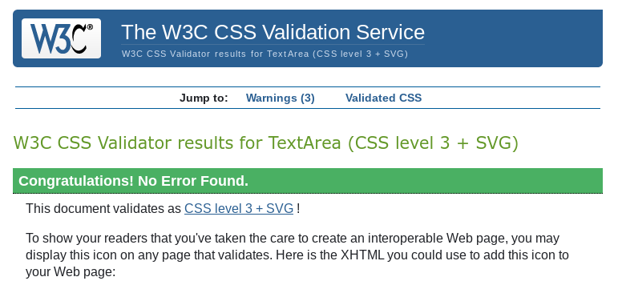

* The warnings relate to two vendor extentions and one warning regarding the imported stylesheet. No action required. 

3. **JavaScript validated on [JSHint](https://jshint.com/)**

* Zero errors were found initially:

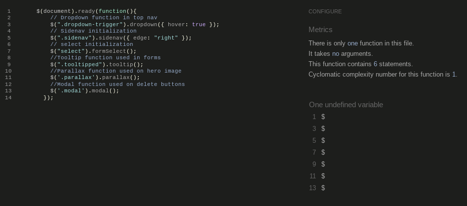

## Automated Testing
___
### Lighthouse Testing

After inital lighthouse testing, I implemented some recommendations to improve scores - 
* Added alt attributes to improve accessibility for the images on the recipe cards.
* Removed stray tags from my recipes page
* The user uploaded images being served from urls was the biggest issue for the performance scores in lighthouse. After undertaking some research on the topic, I would in the future look into using a better method of serving such images, likely by using a package such as Imagemagick or a service such as Cloudinary. Further study on these packages is required outside the time contraints of this project.

**Lighthouse results:**
* Home page
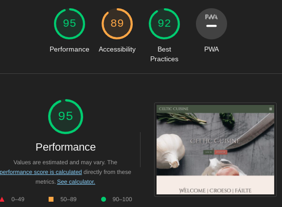

* Add Nation page
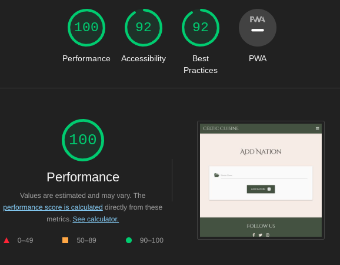

* Edit Recipe page
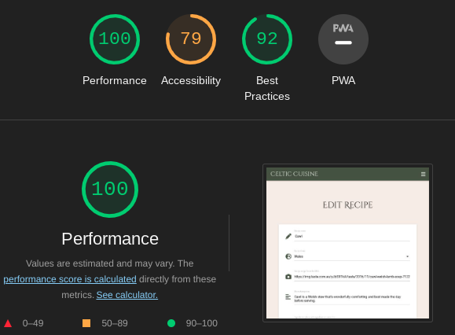

* Full Recipe page
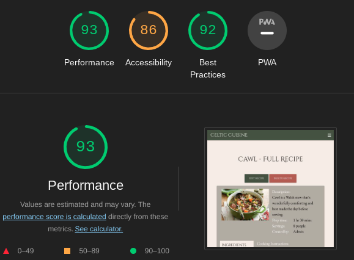

* My Recipes page
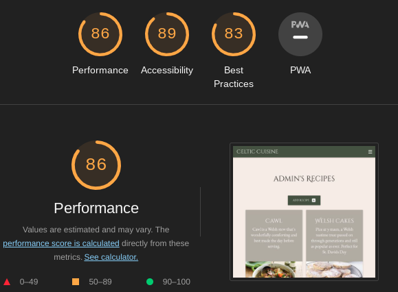

* Recipes page


* Register page
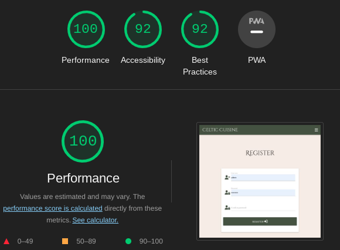

* Log In page
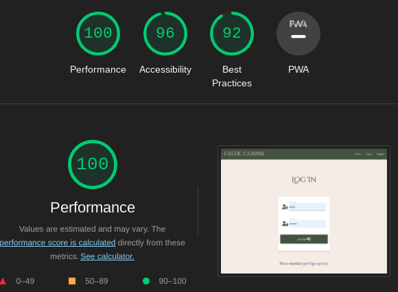


[Back to Contents](#contents)
***
## Manual Testing
___
### Functionality Testing

I used Google Chrome Dev Tools at all stage of this project to continuously check how well different elements of the site were working. This is particularly useful when checking the responsiveness of each setion and feature as I worked on them. 

The following are the steps taken to manually test each feature of the website. 

Home Page as a non logged in user:

* Nav Bar
    + clicked on 'Celtic Cuisine' logo at the left side of the nav bar to ensure home page loads. 
    + clicked on the 'Home' link to ensure it returned me to home page.
    + clicked on the 'Register' link to ensure it brought me to the user registration page.
    + clicked on the 'Log In' link to ensure it loaded the user log in page.
    + all above were also checked with Navbar in the collapsible side nav state to ensure it functioned as expected.

* Footer
    + clicked on each of the 3 social media links to ensure these opened in a new page and correctly brought the user to the relevent social media sites.

* Content
    + clicked on each link to ensure they function as expected:
        1. 'View Recipes' link brings user to recipes page for the correct nation category
        2. 'Register here' link brings user to register page
        

Home Page as a logged in user
* Nav Bar
    + visual check to ensure as a logged in user, the 'Register' and 'Log in' links no longer display and are replaced with 'Add Recipe' and log out links.
    + clicked on 'Add Recipe' link to ensure it brings user to the add recipe form page.
    + clicked on the 'Log out' link to ensure it logged me out of my account. 

* Content
    + visual check to ensure as a logged in user, the 'Register' and 'Log in' buttons no longer display and are replaced with 'Add Recipe' link.
    + clicked on the 'My Recipes' link to ensure it took me to the my_recipes page.


Recipes Page
* All of the above steps for the Navbar and Footer links were repeated to ensure all worked as expected from this page. 
* Steps repeated as a non logged in user as well as a logged in user.
    + click on each card display to ensure card is functioning as expected and full recipe page was accessed when clicking 'full recipe button'
    + clicked on 'Add Recipe' link to ensure it brings user to the add recipe form page.


Full Recipe Page
* All of the above steps for the Navbar and Footer links were repeated to ensure all worked as expected from this page. 
* Steps repeated as a non logged in user as well as a logged in user.
    + 'Edit Recipe' and 'Delete Recipe' buttons hidden for users who did not create the recipe.
    + 'Edit Recipe' and 'Delete Recipe' buttons visible for user who did create the recipe.
    + 'Delete Recipe' button visible for Admin.


Register page
* All of the above steps for the Navbar and Footer links were repeated to ensure all worked as expected from this page. 
* Further steps taken:
    + tested username field validation by entering no characters, less characters than advised, special characters and tried registering, form validation functioned as expected and provides the user with feedback if not filled correctly
    + repeated these steps in the password field, all functions as expected. 
    + ensured confirm password field was compared with password field by deliberately typing incorrect confirmation.
    + tested with entering a username known to already exist to ensure a duplicate is not accepted and a messsage is returned to user that that username already exists. 
    + tested link to log in page if user is already registered.
    + tested with creating a new user to ensure register form functions correctly and user is brought to the home page and a success message is displayed to user, and nav links change to display correct options for a registered user


Log In Page
* Repeated all of the above steps with regard to checking validation on username and password fields 
* Further steps taken:
    + attempted to log in with a username known to not be registered already
    + attempted to log in with an incorrect password for an already registered account 
    + both steps resulted in log in failing, message being displayed to user that an incorrect username and or password was used and reloading the log in form to allow user make another attempt. 
    + logged in as registered user to ensure log in accepted as expected and user brought to their profile page
    + clicked on register link to ensure user is redirected to the register page if they have not yet done so.


**Further functionality testing with a logged-in user** 

My Recipes Page/Add New Recipe Page/Edit & Delete functions
* Repeated all above steps for navbar and footer functionality. 
* Further steps taken:
    + Log in as a user that has no recipes to ensure correct message displayed in the my_recipes page. 
    + Logged out and logged back in as same user to ensure recipes added by that user display correctly on profile page. 
    + Tested various scenarios to prompt flash messages to make sure all feedback messages to the user display as intended. 

Admin additional functionality  
* Logged in as admin to ensure that:
    + On the home page, all nations cards show the edit and delete buttons below and that these function correctly.
    + Add Nation button displays above nations cards.
    + Added a new nation and deleted it to ensure functions worked correctly
    + Deleted a recipe added by another user. 

[Back to Contents](#contents)
___


#### Responsiveness
* Checked the responsiveness of the website at every stage of development throughout the project using Chrome Dev Tools. 


#### Cross Browser
The website was developed and tested primarily using the Chrome browser. I then checked the following browsers to ensure all worked as expected - 
+ Firefox
+ Safari
+ Microsoft Edge

[Back to Contents](#contents)
___


### User Stories Testing

#### As a New User :
* 001 - I want to to be able to access and view the website on the device I'm using.
    + The website is responsive and able to be viewed on any screen size from 320px to 1200px and above.
    + This was tested on numerous devices including android and iOS mobile devices, tablets and desktops.
* 002 - I want to to be able to understand the website immediately.
    + The style and layout, along with the interactive features and prompts enable first-time users to understand the website, the theme and it's purpose.
* 003 - I want to to be able to navigate the website with ease.
    + The simplicity and the interactive prompts and layout make the website very clear to understand for any first-time user.
* 004 - I want to to be able to contact the website developers if I wish to.
    + The Footer social links are clear and obvious from every page. A minimal styling setup ensures that the links are displayed clearly. All contact information is found after clicking on thiese logos.
* 006 - I want a reason to return.
    + The ability for the user to view the entire libraby of recipes is a reason to return. The option to register and share their own is another. The possibility that new recipes will have been added by other users may also tempt users to return.

#### As a Returning User :
* 001 - I want to find information about the company's background, their story and growth.
    + The social media links found on the footer of every page provides links to all of the developers social media (instagram, facebook, twitter, LinkedIn). The contact information can be found on those platforms. For example the developercontact info is on LinkedIn, along with all professional history.
* 002 - I want to find the best way to get in contact with the company with any questions I may have.
    + As above, the contact information can be found on the social media platforms, linked in the footer of each page. They provide a quick and direct link to the website's developer.
* 003 - I want to be able to easily log in to my account.
    + There is a log in link in the nav bar at the top of each page. There is a log in button on the hero image in the center of the home page.
* 004 - I want to be able to view my own recipes.
    + There is a 'My Recipe' link in the nav bar that takes the user directly to their recipes page once they are logged in. upon log-in the user is taken directly to their own recipe catalogue.
* 005 - I want to be able to add my own recipes.
    + There is an 'Add Recipes' link in tte nav bar, as well as below the titles of the 'recipes' and 'my recipes' pages.
    + These link the user with the 'add recipes' page where there is a simple form to fill in, with a button below that lets the user submit their recipe.
* 006 - I want to be able to edit my own recipes.
    + On the 'full recipe' page, the selected recipe can be edited by clicking the 'Edit Recipe' button clearly visible below the page title.
    + The 'Edit Recipe' button is only accessible to the user that created the recipe.
* 007 - I want to be able to delete my own recipes.
    + Next to the 'Edit Recipe' button is a 'Delete Recipe' button which is visible only to the user who created the recipe and admin.
    + When the delete recipe button is clicked, a modal opens to ask the user to confirm whether they want to delete the recipe. upon confirmation the recipe is deleted from the database, returning the user to their 'my recipes' page which will no longer include the delelted recipe.
* 008 - I want to to be able to access and view the website on a range of devices/browsers.
    + The site has been tested for ease of access and responsiveness on several devices (rhanging from mobile phones and tablets, laptops, desktop computers and larger Samsung TVs) and is fully responsive from at least 320px up to 1200px and more.


#### As an Admin :
* 001 - I want to have more control than any other user.
    + The admin has all the rights and features avaiable to a standard registered user. Additionally, the admin has the ability to manage the Nations categories. They have full CRUD functionality for the nations categories.
    + The admin also has the additional ability to delete any recipe they want. They are not able to edit recipes that wwere not created by admin. This was decided in order to assure users that their recipes cannot be changed by anyone except for themselves, although admin still reserves the ability to delete any inappropriate content.
    + This is achieved through the following code attached to every related function in the routes.py file:
    ```
    session["user"] != "admin":
    ```
    and 
    ```
    session["user"] == "admin":
    ```
* 003 - I want to be able to add data to the website.
    + The admin can add Nation categories via the 'Add Nation' button found oabove the nations cards.
    + Admin also has the ability to add recipes like other users.
* 004 - I want to be able to edit data from the website.
    + The admin can edit the names of the Nations categories.
    + They can also edit the recipes added via the admin account.
* 005 - I want to be able to delete data from the website.
    + The admin can delete the Nations categories. When the 'Delete' button is clicked below the nation card, a modal appears asking whether they are sure they want to delete the category along with any recipes stored within that category. By clicking delete again the category will be deleted in PostgreSQL and the associated recipes from MongoDB and will no longer appear on the website.
    + Admin can also delete recipes from any user from the full recipe page.


[Back to Contents](#contents)
___
### Bugs and Fixes


* Had numerous problems creating the tables in Postgres via the terminal. After many hours spent with Technical Suppport agents at Code Institute, I decided to restart the project, having been unable to find a solution. At the second attempt the tables were created without any issues.

* The images of the flags found on the Nations cards are saved as the name of the Nation they represent e.g. wales.png for the Welsh flag. They were linked to the nations card using the code:-
```
<span class="image"></span>
```

Every flag image loaded, apart from the flag for 'Isle of Man'. I realised that this was due to the spaces in between the three words in the name. With the use of the '.replace()' python function. Thus, the code was altered to:-

```
<span class="image"></span>
```
The idea for this solution came from a Stack Overflow question posted here: [Stack Overflow](https://stackoverflow.com/questions/36355482/replace-multiple-values-with-jinja2).

* The buttons on the hero image were not clickable. I eventually worked out that this must have been due to the buttons being placed behind another layer of the Parallax code used for the hero image. Using a Z index of 1 on the parralax container and a Z index of 999 on the .btn class resolved the issue.

* On tablet, Scotland and Wales cards would not stay in the same row on the home page. I initially tried to fix the minimum height of the cards in css which solved the issue at some screen sizez however, eventually media queries were added to style.css in order to fully resolve the issue.

* Ingredients were originally stored in MongoDB as an array but I was unable to access these arrays or make them display on the 'full recipe' page. Having been unable to find a solution to the problem, I finally decided to change the way that the ingredients were stored from array to a string. 

* Displaying a string as list: having managed to make the ingredients appear on the 'full recipe' page as a string, I had to find a way of displaying the string of data as a list. I discovered a similar recipe site on slack - https://github.com/Medusas71/Megs-Italian-Kitchen - on this site I discovered the .splitlines() function that can be used in order to achieve the list appearance needed for the ingredients category.

* google fonts was not rendering in the nav bar. I assumed that this was due to the font being blocked by one of the Materialize classes. as such I created a new 'header-title' class for the logo in order to manipulate the text in my style.css file. I discovered that using '!important' at the end of the css rule overrided the font class implemented by the Materialize classes


* On the 'Edit Recipe' page, each form input field should be pre'loaded with the currently stored information. Whilst the rest of the fields displayed correctly, the recipe description field remained blank for all the recipes that I attemplted to edit. Finally I discovered that as the description is typed into a textarea, as opposed to a form input field, the jinja function needed to be written into the text area itself, as opposed to within the "value" attrribute, as with form inputfields - discovered solution at https://stackoverflow.com/questions/10545158/textfield-is-not-displaying-initial-value. The Stack Overflow page advises that a textarea field does not use the value attribute.

* During testing, it was recognised that deleting a nation category would delete the Nation card on the home page and the category within the Postgres table, but the recipes associated with that category were still found on MongoDB recipes collection. A simple line of code - mongo.db.tasks.delete_many({"category_id": str(category_id)}) - added to the delete_nation function resolved the issue.


### Bugs not yet fixed
* The recipe cards in the 'recipes' and 'my_recipes' paages can be different lengths, depending on the amount of data that was input by the user. This means that when there are multiple recipes on the page, the recipes sometimes skip a column, meaning that there are only two or one recipe cards it a specific row. I know that this could be resolved using css, however this was not achieved du to the time restraints associated with the project. This wissue will be resolved at a later date.

[Back to Contents](#contents)
___
